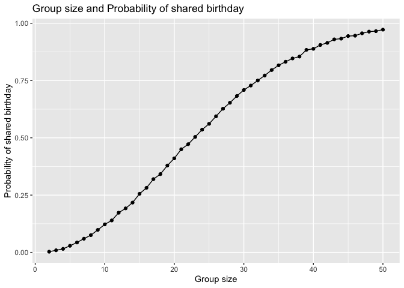

p8105_hw5_hz3023
================
Huiyi Zhu
2025-11-14

## Prepare

``` r
library(tidyverse)
```

    ## ── Attaching core tidyverse packages ──────────────────────── tidyverse 2.0.0 ──
    ## ✔ dplyr     1.1.4     ✔ readr     2.1.5
    ## ✔ forcats   1.0.1     ✔ stringr   1.5.2
    ## ✔ ggplot2   4.0.0     ✔ tibble    3.3.0
    ## ✔ lubridate 1.9.4     ✔ tidyr     1.3.1
    ## ✔ purrr     1.1.0     
    ## ── Conflicts ────────────────────────────────────────── tidyverse_conflicts() ──
    ## ✖ dplyr::filter() masks stats::filter()
    ## ✖ dplyr::lag()    masks stats::lag()
    ## ℹ Use the conflicted package (<http://conflicted.r-lib.org/>) to force all conflicts to become errors

## Problem 1

``` r
birthday = function(n) {
    days = sample(1:365, size = n, replace = TRUE)
    length(unique(days))<n
}
set.seed(123)

set.seed(20)
result =
  expand_grid(
    group_size = 2:50,
    iter = 1:10000)|>
  mutate(share_bday = map_lgl(group_size, birthday))|>
  group_by(group_size) |>
  summarize(prob_sharebday = mean(share_bday))

result |>
  ggplot(
    aes(x = group_size, 
        y = prob_sharebday)) +
  geom_line() +
  geom_point() +
  labs(
    x = "Group size",
    y = "Probability of shared birthday",
    title = "Group size and Probability of shared birthday"
  )
```

<!-- -->

In this plot we can see that the probability of at least two people
sharing a birthday increase when group size grows. When the group size
reaches near 25, the probability exceeds 50%. After about 50 people, the
probability is very close to 1, which indicates that two people shared a
birthday are almost guaranteed.
