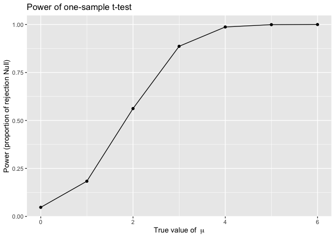
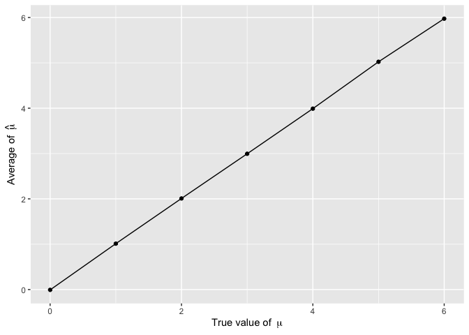
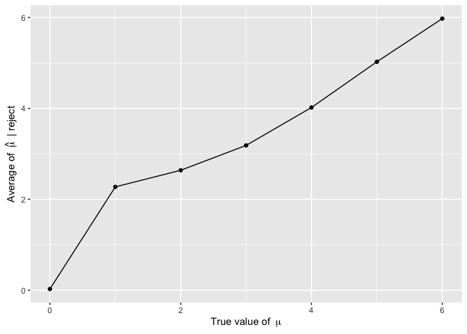
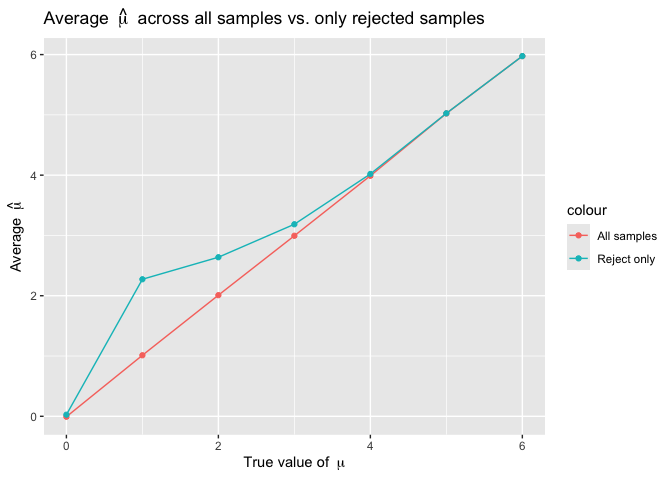

p8105_hw5_hz3023
================
Huiyi Zhu
2025-11-14

## Prepare

``` r
library(tidyverse)
```

    ## ── Attaching core tidyverse packages ──────────────────────── tidyverse 2.0.0 ──
    ## ✔ dplyr     1.1.4     ✔ readr     2.1.5
    ## ✔ forcats   1.0.1     ✔ stringr   1.5.2
    ## ✔ ggplot2   4.0.0     ✔ tibble    3.3.0
    ## ✔ lubridate 1.9.4     ✔ tidyr     1.3.1
    ## ✔ purrr     1.1.0     
    ## ── Conflicts ────────────────────────────────────────── tidyverse_conflicts() ──
    ## ✖ dplyr::filter() masks stats::filter()
    ## ✖ dplyr::lag()    masks stats::lag()
    ## ℹ Use the conflicted package (<http://conflicted.r-lib.org/>) to force all conflicts to become errors

``` r
library(broom)
```

## Problem 1

``` r
birthday = function(n) {
    days = sample(1:365, size = n, replace = TRUE)
    length(unique(days))<n
}
set.seed(123)

set.seed(20)
result =
  expand_grid(
    group_size = 2:50,
    iter = 1:10000)|>
  mutate(share_bday = map_lgl(group_size, birthday))|>
  group_by(group_size) |>
  summarize(prob_sharebday = mean(share_bday))
```

``` r
result |>
  ggplot(
    aes(x = group_size, 
        y = prob_sharebday)) +
  geom_line() +
  geom_point() +
  labs(
    x = "Group size",
    y = "Probability of shared birthday",
    title = "Group size and Probability of shared birthday"
  )
```

<!-- -->

In this plot we can see that the probability of at least two people
sharing a birthday increase when group size grows. When the group size
reaches near 25, the probability exceeds 50%. After about 50 people, the
probability is very close to 1, which indicates that two people shared a
birthday are almost guaranteed.

## Problem 2

``` r
sim_ttest = function(mu){
  x=rnorm(n = 30, mean = mu, sd = 5)
  ttest=t.test(x, mu=0)
  tidy(ttest) |> 
    select(estimate, p.value) |> 
    rename(mu_hat=estimate) |> 
    as_tibble()
}
set.seed(20)
results =
  expand_grid(
    true_mu=0:6,
    iter = 1:5000) |>
  mutate(
    output= map(true_mu, sim_ttest)) |>
  unnest(output)
```

``` r
power_results =
  results |>
  mutate(reject = p.value < 0.05) |>
  group_by(true_mu) |>
  summarize(power = mean(reject))

power_results |>
  ggplot(aes(x = true_mu, y = power)) +
  geom_line() +
  geom_point() +
  labs(
    x = expression("True value of " ~ mu),
    y = "Power (proportion of rejection Null)",
    title = "Power of one-sample t-test"
  ) 
```

<!-- -->

In this plot, the power increases as the true value of $\mu$ increases.
When $\mu = 0$, the power is below 0.125, and by the time $\mu = 4$, the
power is already close to 1.

``` r
avg_mu =
  results |>
  group_by(true_mu) |>
  summarize(
    mean_mu_hat = mean(mu_hat)
  )

ggplot(avg_mu, aes(x = true_mu, y = mean_mu_hat)) +
  geom_point() +
  geom_line() +
  labs(
    x = expression("True value of " ~ mu),
    y = expression("Average of " ~ hat(mu))
  )
```

<!-- -->

``` r
avg_mu_reject =
  results |>
  group_by(true_mu) |>
  summarize(
    mean_mu_hat_reject = mean(mu_hat[ p.value < 0.05]),
  )
ggplot(avg_mu_reject, aes(x = true_mu, y = mean_mu_hat_reject)) +
  geom_point() +
  geom_line() +
  labs(
    x = expression("True value of " ~ mu),
    y = expression("Average of " ~ hat(mu) ~ " | reject")
  )
```

<!-- -->

``` r
combined =
  left_join(avg_mu, avg_mu_reject, by = "true_mu")
ggplot(combined, aes(x = true_mu)) +
  geom_line(aes(y = mean_mu_hat,color = "All samples")) +
  geom_point(aes(y = mean_mu_hat,color = "All samples")) +
  geom_line(aes(y = mean_mu_hat_reject,color = "Reject only")) +
  geom_point(aes(y = mean_mu_hat_reject,color = "Reject only")) +
  labs(
    x = expression("True value of " ~ mu),
    y = expression("Average " ~ hat(mu)),
    title = expression("Average " ~ hat(mu) ~ " across all samples vs. only rejected samples"),
  )
```

<!-- -->

No, the sample average of $\mu$̂ among rejected test is not
approximately equal to the true $\mu$. Because the rejection only
happens when $\mu$̂ is far from 0.

## Problem 3
